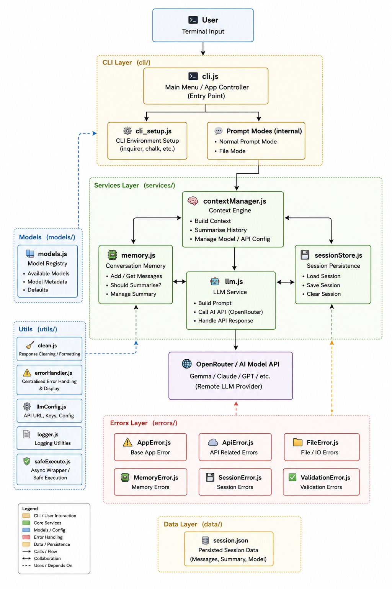

# Context CLI Assistant

A flexible **Node.js command-line AI assistant** that lets users chat with an LLM, analyse files, and switch between models — all from the terminal.

Motivation: I have been wanting to develop a simple program utilising Generative AI and decided it would be useful to develop a simple program that allows the user to choose between ordinary natural language and 'file' mode that allows the user to analyse file and ask questions. I decided upon using Openrouter as it simplifies the process of providing a number of different LLM's that can be accessed from one API. Openrouter is a LLM API Gateway that provides a single source of entry for LLMs and for budgets to be easily monitored.

This project allows users to:

- Ask general AI questions
- Upload and analyse files
- Maintain persistent chat memory
- Summarise conversation history
- Restore previous sessions
- Switch between AI models
- Build long-running contextual conversations

This application evolved from a simple CLI experiment into a more structured backend-style architecture with reusable services, context management, persistent memory, and custom error handling.

**Next stage:**

My intention is to further develop a user-centric AI tool that will allow the user to control variables such as temperature or latency and perform a range of agent driven tasks.

The next version will be focused on addition of a backend node/express server with routers and controllers with backend database storage. The end goal will be to add a simple typescript frontend using vite/react that will allow the user to post questions to the llm including file upload analysis and that will persist state across sessions. There will be the ability to ask the agent to provide a set list of tasks.


## Features

## AI Chat

- Ask natural language questions
- Maintain contextual conversations
- Persistent session memory between runs

---

## File Analysis

Supports:

- `.txt`
- `.docx`

Users can load files and ask questions about the contents.

---

## Persistent Memory

The application stores:

- Recent conversation history
- Summarised historical context
- Selected model
- Loaded file context

Sessions can be restored on application restart.

---

## Context Summarisation

To avoid endlessly growing prompts and token limits, older messages are periodically summarised into concise rolling summaries.

This enables:

- Reduced token usage
- Longer conversations
- Improved memory management

---

## Model Switching

Supports multiple OpenRouter models via configurable model selection.

---

## Custom Error Handling

Reusable error system with:

- `AppError`
- `ApiError`
- `FileError`
- `SessionError`
- `ValidationError`

Centralised error handling utilities provide cleaner debugging and safer async execution.
<!-- ### Direct AI Chat

Ask natural language questions directly from the terminal:

For example: `"Explain closures in JavaScript"`

### File Analysis Mode

Load a file and ask questions about its contents:

```bash
Summarise this report
What dates are mentioned?
Extract action items
```

Supports readable text-based files such as:

- `.txt`
- `.md`
- `.csv`
- `.json`
- `.log`

(Additional formats like PDF / DOCX can be added)

---

### Multi-Model Support

Switch between configured models such as:

- Gemma
- Nemotron
- Other OpenRouter-compatible models

---

### Interactive CLI Menu

```text
1. Ask a normal question
2. Analyse a file
3. Change model
4. Exit
```

--- -->

# Project Structure

```text
simple-interactive-ai-tool/
│
├── cli/
│   ├── cli.js
│   └── cli_setup.js
│
├── services/
│   ├── llm.js
│   ├── contextManager.js
│   ├── memory.js
│   └── sessionStore.js
│
├── errors/
│   ├── AppError.js
│   ├── ApiError.js
│   ├── FileError.js
│   ├── MemoryError.js
│   ├── SessionError.js
│   └── ValidationError.js
│
├── utils/
│   ├── clean.js
│   ├── errorHandler.js
│   ├── logger.js
│   ├── llmConfig.js
│   └── safeExecute.js
│
├── data/
│
├── models/
│
├── package.json
└── README.md
```

## Architecture

<!-- this will have an image -->


# Getting Started

## 1. Clone Repository

```bash
git clone https://github.com/yourusername/yourrepo.git
cd yourrepo
```

---

## 2. Install Dependencies

```bash
npm install
```

---

## 3. Configure API Key

Create a `.env` file:

```env
OPENROUTER_API_KEY=your_api_key_here
```

---

## 4. Run Application

```bash
npm start
```

# Example Usage

## Normal Question

```text
Choose option: 1

Enter your question:
> What is dependency injection?
```

---

## File Analysis

```text
Choose option: 2

Enter file path:
> ./notes.docx

Ask about file:
> summarise this
```

---

# Dependencies

Install manually if required: (optional)

```bash
npm install axios chalk dotenv mammoth
```

---

# Environment Variables

| Variable                          | Description            |
| --------------------------------- | ---------------------- |
| OPENROUTER_API_KEY="123454678910" | API key for OpenRouter |

---

# Supported Providers

Through OpenRouter:

- Google Gemma
- Claude
- GPT models
- Mistral
- Llama
- Nemotron
- Many others

# Troubleshoot:

## Invalid API Key

Check:

```env
OPENROUTER_API_KEY=
```

## File Cannot Be Read

Use correct relative path:

```bash
./documents/report.txt
```
